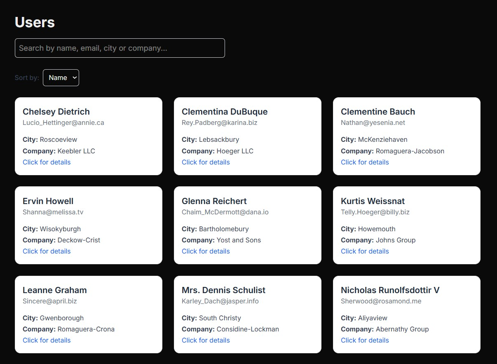

# AdversterX Frontend Test

This is a test assignment for the **Front-end Developer** position at **AdversterX**.

---

## 📸 Preview




## 🧩 Features

- Fetches users from the API: [jsonplaceholder.typicode.com/users](https://jsonplaceholder.typicode.com/users)
- Displays users as responsive cards
- Filtering by name, email, city, and company
- Sorting by name or city
- "Clear" filter button
- Built with **OOP (class-based)** architecture in TypeScript
- Fully responsive layout for mobile and desktop
- Smooth fade-in animation for user cards

---

## ⚙️ Technologies

- [Next.js 14+ (App Router)](https://nextjs.org/)
- [TypeScript](https://www.typescriptlang.org/)
- [Tailwind CSS](https://tailwindcss.com/) (`@import 'tailwindcss'` syntax used)
- Fully typed, without use of `any`

---

## 🚀 Local Setup

```bash
git clone https://github.com/Rinya7/adversterx-users-app.git
cd adversterx-users-app
npm install
npm run dev
```
